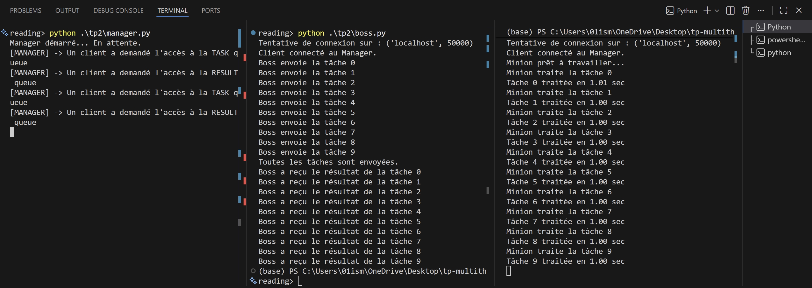

# TP Multithreading et Systèmes Distribués

Ce dépôt contient une série d'exercices pratiques sur le multithreading en Python et l'informatique distribuée avec une architecture hybride C++/Python.

## 📋 Vue d'ensemble des TPs

### TP1 : Logique de base & Résolution matricielle
**Principe étudié :** 
- Manipulation de matrices avec NumPy
- Résolution de systèmes d'équations linéaires (Ax = b)
- Tests unitaires et validation mathématique

**Comment exécuter :**
```bash
# Exécuter les tests unitaires
python3 test_task.py
```

**Ce que fait le code :**
- Crée des matrices aléatoires de taille variable
- Résout le système linéaire Ax = b
- Vérifie la précision de la solution

---

### TP2 : Gestionnaire distribué Python (Boss/Minion)
**Principe étudié :**
- Architecture distribuée avec `multiprocessing.managers`
- Communication inter-processus via queues partagées
- Pattern Boss/Minion (producteur/consommateur)

**Comment exécuter :**
```bash
# Terminal 1 : Démarrer le gestionnaire (serveur central)
python3 tp2/manager.py

# Terminal 2 : Démarrer le minion (worker)
python3 tp2/minion.py

# Terminal 3 : Démarrer le boss (client qui envoie les tâches)
python3 tp2/boss.py
```

**Architecture :**
- **Manager** : Serveur central qui gère deux queues partagées (tâches et résultats)
- **Boss** : Envoie 10 tâches dans la queue et attend les résultats
- **Minion** : Récupère les tâches, les exécute, et renvoie les résultats

**Resultats :**  


---

### TP3 : Sérialisation JSON
**Principe étudié :**
- Sérialisation/désérialisation d'objets Python
- Conversion d'objets complexes en JSON pour la transmission réseau
- Tests d'égalité avec tolérance pour les valeurs flottantes

**Comment exécuter :**
```bash
# Exécuter les tests de sérialisation
python3 -m unittest tp3.test_task_json
```

**Ce que fait le code :**
- Convertit un objet `Task` en chaîne JSON
- Reconstruit l'objet à partir du JSON
- Vérifie que l'objet reconstruit est identique à l'original

---

### TP4 : Système distribué hybride C++/Python
**Principe étudié :**
- Architecture multi-langages (C++ pour le calcul, Python pour la coordination)
- API REST avec Flask comme proxy de communication
- Calcul haute performance avec Eigen3 en C++

**Comment exécuter :**

**1. Compiler les exécutables C++ :**
```bash
cd tp4
mkdir build && cd build
cmake ..
make
```

**2. Démarrer le système (3 terminaux nécessaires) :**

```bash
# Terminal 1 : Proxy Python (API REST)
cd tp4
python3 proxy.py
```

```bash
# Terminal 2 : Minion C++ (worker)
cd tp4/build
./minion
```

```bash
# Terminal 3 : Boss C++ (client)
cd tp4/build
./boss
```

**Architecture :**
- **Proxy (Python/Flask)** : Serveur HTTP sur le port 8000 avec deux endpoints (`/task_queue` et `/result_queue`)
- **Boss (C++)** : Envoie 10 tâches via requêtes HTTP POST et récupère les résultats via GET
- **Minion (C++)** : Récupère les tâches, résout les systèmes matriciels avec Eigen3, et renvoie les résultats

**Resultats :**  


---

## 📝 Licence

MIT License - Voir le fichier `LICENSE` pour plus de détails.
